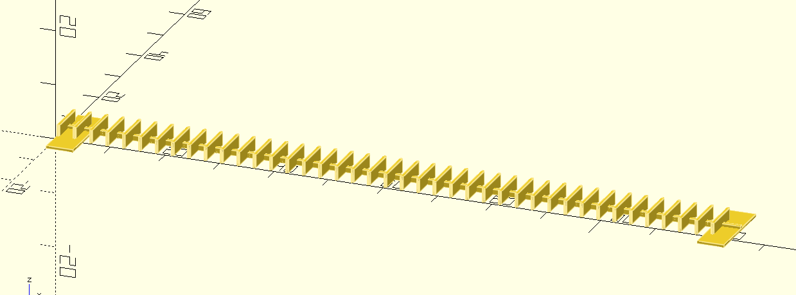

# thinkpad-paint-cover

This repo contains a 3D printable, parametrizable openSCAD design to cover the ventilation slots of a laptop (e.g., ThinkPad) during spray painting.

The contact surface to the printing bed (the surface where the 3D print adheres during printing) is increased on each side of the string to prevent lift-off.

  

> [!TIP]
> I'd recommend increasing the height to increase the spacing of the crossbar to the surface and letting paint in beneath it.